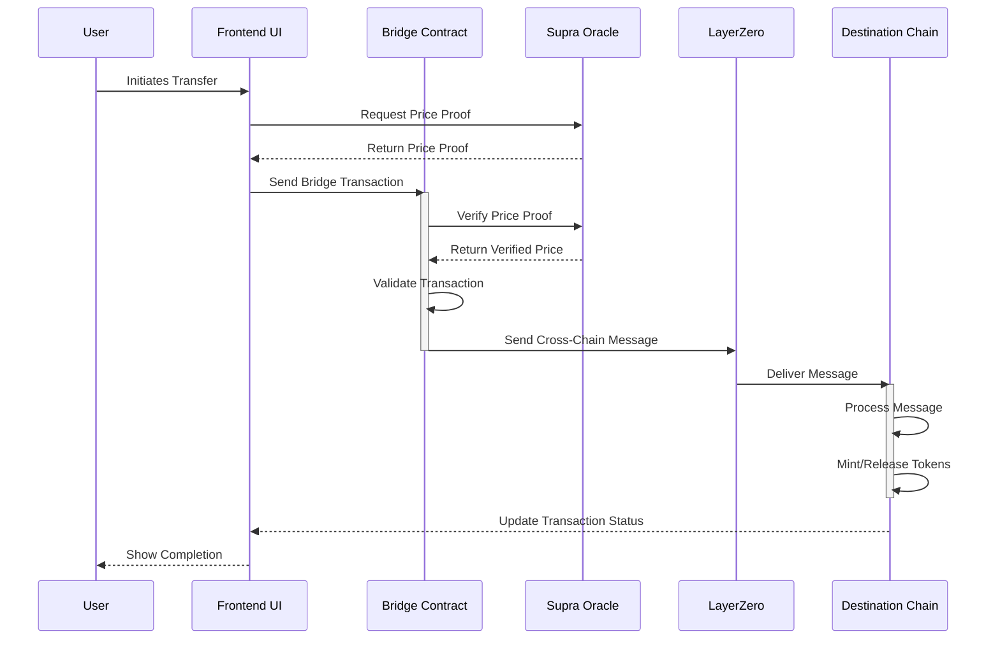

# Getting Started with Create React App

This project was bootstrapped with [Create React App](https://github.com/facebook/create-react-app).

## Available Scripts

In the project directory, you can run:

### `npm start`

Runs the app in the development mode.\
Open [http://localhost:3000](http://localhost:3000) to view it in your browser.

The page will reload when you make changes.\
You may also see any lint errors in the console.

### `npm test`

Launches the test runner in the interactive watch mode.\
See the section about [running tests](https://facebook.github.io/create-react-app/docs/running-tests) for more information.

### `npm run build`

Builds the app for production to the `build` folder.\
It correctly bundles React in production mode and optimizes the build for the best performance.

The build is minified and the filenames include the hashes.\
Your app is ready to be deployed!

See the section about [deployment](https://facebook.github.io/create-react-app/docs/deployment) for more information.

### `npm run eject`

**Note: this is a one-way operation. Once you `eject`, you can't go back!**

## Project Structure

- `src/`: Contains the source code for the React application.

  - `components/`: Contains React components.
  - `contexts/`: Contains context providers for state management.
  - `contracts/`: Contains smart contract ABIs and interaction logic.
  - `services/`: Contains services for handling errors, interacting with the Supra Oracle, etc.
    - `errorHandler.js`: Defines custom error classes and error handling logic.
    - `pullServiceClient.js`: Defines the client for interacting with the Supra Oracle.
  - `App.js`: The main React component.
  - `index.js`: The entry point for the React application.

- `scripts/`: Contains scripts for deploying and initializing smart contracts.

  - `deploy.js`: Script for deploying smart contracts.
  - `initialize-bridges.js`: Script for initializing bridges.
  - `runSupra.js`: Script for running Supra Oracle interactions.

- `public/`: Contains static assets and the main HTML file.

# Transfer Process Sequence Diagram

